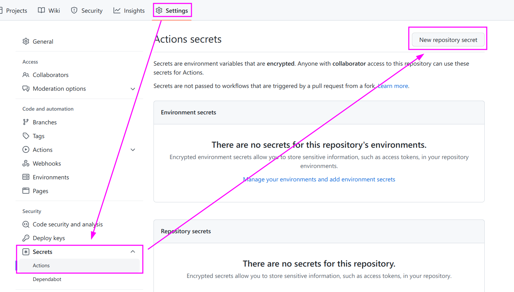
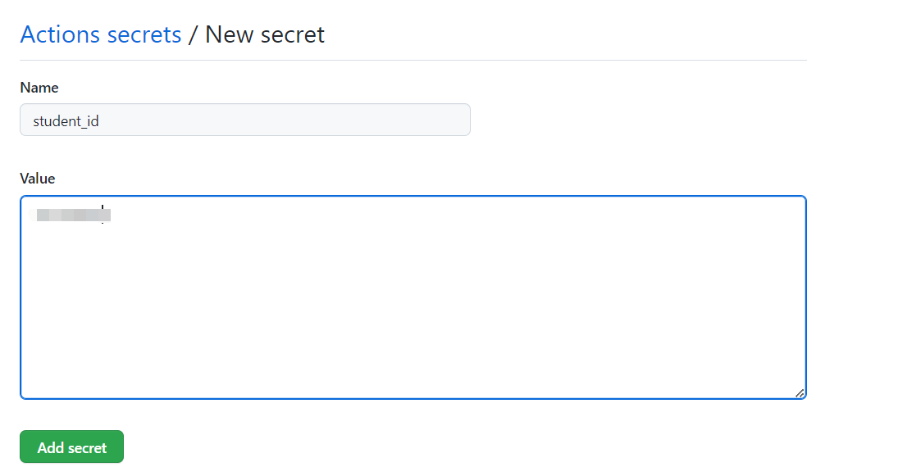
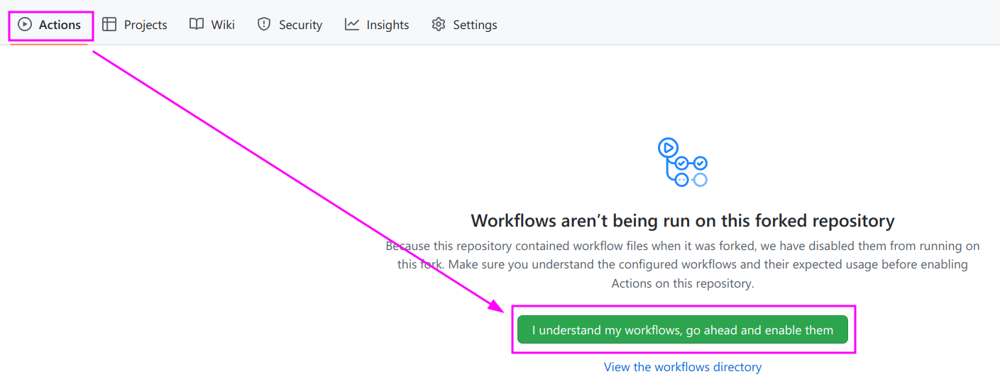
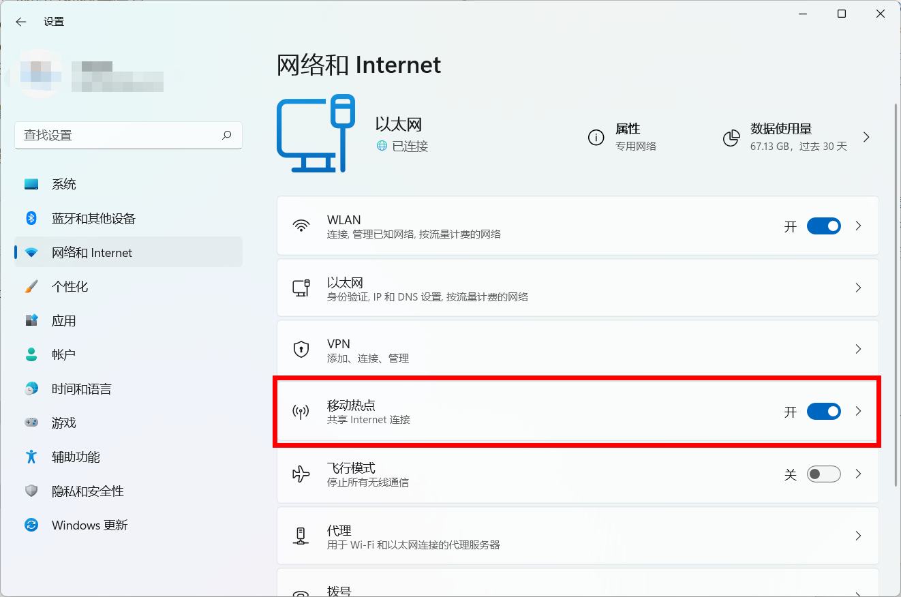
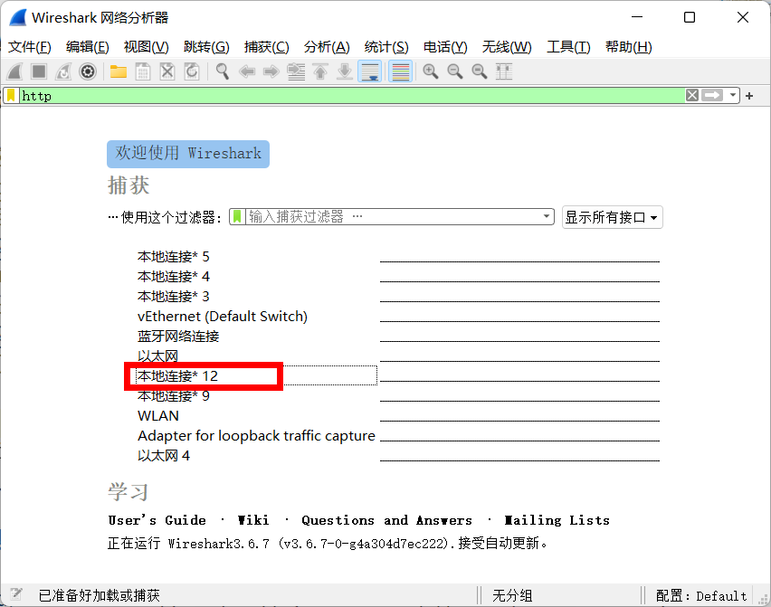
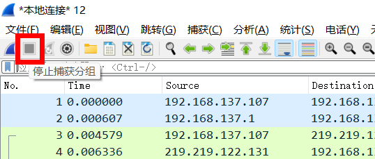
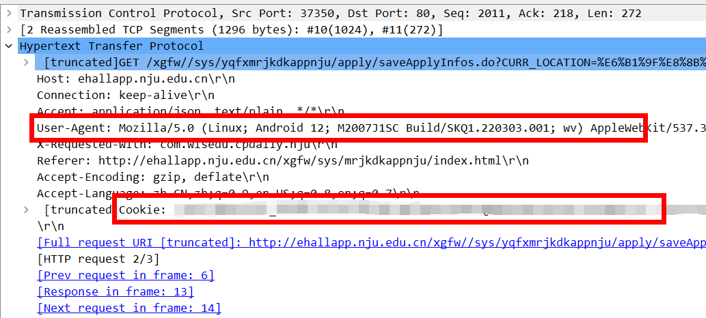

# NJU_Health-Checkin

---
2022-09-03 18: 修复部分同学学号长度为12的问题，感谢 [i-Pear](https://github.com/i-Pear) 的PR  
2022-09-02 18: 已修复登录问题，感谢 [@log2dx](https://github.com/log2dx) 的PR  
2022-09-02 16: 似乎还存在问题，暂时还没有修复  
2022-09-02 11: 更新适用于最新的统一身份认证安全登录
---

**使用方法**

* 在config.json中填写`student_id`、`password`、`User_Agent`(见抓包方法)、上次核酸时间(default表示默认昨天做的核酸)、打卡地点(default表示默认昨天的打卡地点，因此地点更新只需在手机上手动打卡一次即可)，其中student_id、password为**必填项**
* 运行`python checkin.py`即可完成打卡一次
* 若要每天12:00自动运行，请在`contab -e`中添加以下命令：`0 12 * * * cd /path/to/checkin && python checkin.py >> checkin.log 2>&1`
* 或自行查找如何设置Windows下的定时任务

**Github Actions**
* 右上角fork本仓库，之后点击`Create fork`

* 在自己的仓库中点击 Settings -> Secrets -> Actions -> New repository secret

* 对config.json中的每一项进行都新建一个secret(student_id、password为**必填项**，其余默认值见config.json)。自动转换为大写是正常现象

* 点击 Actions -> I understand

* 最后Enable Actions即可，每天中午12:00自动运行，或修改`.github/workflows/checkin.yml`中的`cron`字段来修改运行时间

**config.json解析**

* **student_id**：学号
* **password**：统一身份认证密码
* **location**：打卡地址，"default"表示默认昨天的打卡地点，因此地点更新只需在手机上手动打卡一次即可，或者直接使用字符串表示打卡地点，如"江苏省南京市栖霞区九乡河东路159号"
* **body_temp_ok**：您的体温是否正常
* **health_status**：您的其他健康情况
* **my_health_code_color**：您今日的苏康码显示颜色
* **fam_mem_health_code_color**：您共同居住人今日的苏康码显示颜色
* 注：最近14天是否离宁由程序自动检测最近14天的打卡地址是否含有'南京市'字符串
* **last_RNA**：您的最近一次核酸检测时间，"default"表示默认昨天做的核酸，格式如下："2022-09-01+16"，即2022年9月1日16点
* **try_N_times**：若打卡失败的重试次数，不写为默认0(不重试)

**抓包方法**

* 在电脑上下载[WireShark](https://www.wireshark.org/#download)，并安装
* 打开电脑热点，手机连接上

* 打开cmd，输入`ipconfig`，找到IPv4地址为192.168.XX.1(XX为1~255之间的任意数字都可)的连接，记下其名字，如“本地连接\*12”

* 手机打开打卡界面，填入信息但暂时不点击“提交”
* 打开WireShark，找到之前记下的连接名字

* 双击这个连接，之后手机马上点击“提交”并确定，此时WireShark会进行抓包，此时点击“停止捕获分组”

* 在搜索框中输入"http"，之后回车
* 找到包含下图中红框中的项目，单击它

* 在下面的窗口展开`Hypertext Transfer Protocol`，便可以找到需要填入的`User_Agent`和`Cookie`，右击，复制值，粘贴进config.json中即可(注意json中的引号不要删掉了)

:rotating_light:**请务必如实上报健康状况**，如有异地出行、身体状况变动、本人或家人健康码非绿色，请停止使用此脚本。

### 参考&感谢

[yegcjs/NJU_Health-Checkin](https://github.com/yegcjs/NJU_Health-Checkin)  
